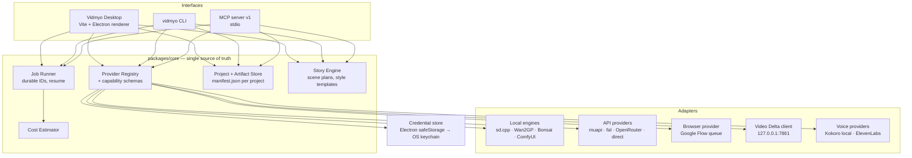
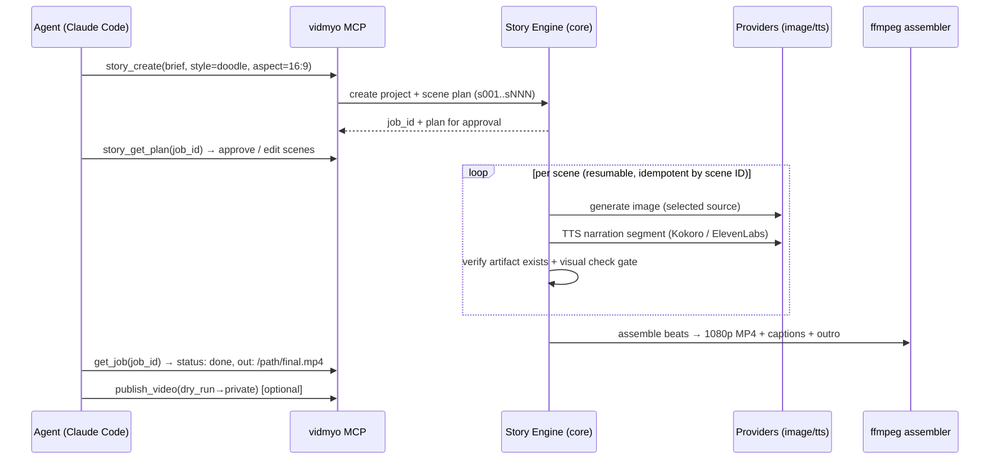

# Vidmyo — Product, Architecture & Commercialization Package

**Date:** 2026-07-03 · **Run:** Claude Fable 5 first run (audit + plan, no broad implementation)
**Repo state:** branch `feat/providers-agents-dock` (dirty, uncommitted feature work), v1.1.0
**Evidence discipline:** every repository claim below is grounded in a file read, command result, or live protocol test from this session, and labeled `verified` / `inference` / `proposal`. External facts are cited.

---

## 1. Executive recommendation

**What Vidmyo should be:** a local-first desktop AI-media studio with an agent twin — one capability core (providers, jobs, projects, artifacts) exposed through two synchronized interfaces: the Electron desktop app and a `vidmyo` CLI + versioned MCP server. Bring-your-own-key and local compute are the product's identity, not a fallback.

**The fastest sellable wedge:** Story Studio's faceless YouTube doodle workflow. The pipeline already exists and is production-proven — but *outside* the product (as the `faceless-doodle-video` agent skill + Omi-documented Curio workflow). Verified this run: there is **zero** Story/doodle code in the app (`grep` across `src/`, `packages/`, `electron/`, `mcp/`). Productizing a proven external pipeline is far cheaper and less risky than inventing new capability. The launch promise: *"Create a complete faceless YouTube doodle video with local tools or your own keys — from one desktop workflow or one agent request."*

**What not to build yet:**
- Embedded pseudoterminal for agents (Terminal-launch + session brief is sufficient and safer — see §7)
- A provider plugin marketplace or signed third-party plugin loading
- Hosted cloud rendering / hosted credits (post-launch add-on)
- New animation styles beyond doodle (the style-neutral engine ships with one style)
- Video Delta semantic-coherence fixes as a launch blocker (parallel research track, §9)
- Full verification of all 20+ catalog providers (verify the 4 with real client code + the wedge's needs; the rest stay catalog-listed with "unverified" badges)

---

## 2. Verified current-state audit

Labels per master prompt: `working` / `partial` / `stub` / `duplicated` / `stale` / `broken` / `not found`.

### 2.1 Application and packaging

| Claim | Verdict | Evidence (this session) |
|---|---|---|
| Product metadata = "open-source AI image, video, cinema and lip sync studio" | **verified · working** | `package.json` description; README header promises "no subscription fees" |
| Dual Next.js + Vite/Electron surfaces | **verified · duplicated** | Vite: `src/main.js` + 14 components; Next: `app/` (agents/api/studio/workflow) + `packages/studio/src` (11 JSX components incl. `VideoDeltaStudio.jsx`, `MarketingStudio.jsx`, `AppsStudio.jsx` that the Vite surface lacks) |
| Electron Builder mac arm64/x64, win x64, linux AppImage/deb | **verified · working** | `package.json` `build` block; `npm run vite:build` passed in 1.87 s this session |
| Version 1.1.0 | **verified** | `package.json` |
| Unsigned / not notarized | **verified** | `gatekeeperAssess: false`; README documents the `xattr -cr` Gatekeeper workaround |
| Open-Poe-AI submodule pin `cb12973` unavailable upstream | **verified · broken for fresh clones, working locally** | `git submodule status` shows `cb12973... (heads/main)` — the local checkout **has** the objects, so local dev works; the commit is missing from the upstream remote, so `npm run setup` on a fresh clone fails. Workspaces also depend on `packages/Open-Poe-AI/packages/agents` and `packages/Vibe-Workflow/packages/workflow-builder` |
| Next.js surface build health | **not exercised this run** | `next build` not run (long-running; Vite surface is the desktop product path) |

### 2.2 Studios and product surfaces

| Surface | Verdict | Evidence |
|---|---|---|
| Image Studio (Vite) | **verified · working** (builds; end-to-end generation not exercised) | `src/components/ImageStudio.js`; local picker labels sd.cpp/Bonsai/ComfyUI per 2026-06-04 handoff |
| Video / LipSync / Cinema Studios (Vite) | **verified · present** | `src/components/{VideoStudio,LipSyncStudio,CinemaStudio}.js`; all bundle in build output |
| Workflow / Agent / MCP-CLI Studios (Vite) | **verified · thin** | build output: `AgentStudio` 0.84 kB, `WorkflowStudio` 0.93 kB gzipped ≈ placeholder-weight; `McpCliStudio` 7.3 kB (docs-style) |
| Local Model Manager | **verified · working** | `src/components/LocalModelManager.js` + `electron/lib/localInference.js` (526 lines) |
| Video Delta Studio component | **verified · present, Next-surface only** | `packages/studio/src/components/VideoDeltaStudio.jsx` — not in the Vite desktop surface |
| Sidebar nav already trimmed | **verified** | `src/components/Sidebar.js`: Canvas (image), Video, Library, Settings |
| Upload/pending-job persistence | **verified · working** | `src/lib/uploadHistory.js`, `src/lib/pendingJobs.js` (localStorage) |
| Story Studio | **not found** | zero matches for story/doodle pipeline code anywhere in app code |

### 2.3 Provider layer

| Claim | Verdict | Evidence |
|---|---|---|
| Catalog drift between the two provider files | **verified · duplicated + drifted** | `src/lib/providers.js` (565 ln): has `openrouter`, `fal`, agent integrations incl. `gemini`; **no `muapi` entry** (muapi key handled via back-compat localStorage in `src/lib/muapi.js:20-22`). `packages/studio/src/providers.js` (530 ln): has `muapi`; **no `openrouter`/`fal`/`gemini`** |
| Providers with real request code | **verified · 4 cloud paths + 4 local engines** | muapi (`src/lib/muapi.js`), fal queue API (`falClient.js`), OpenRouter video-jobs + image chat (`openrouterClient.js`), plus local sd.cpp / Wan2GP / Bonsai / ComfyUI via Electron IPC. All other catalog entries (OpenAI, Anthropic, xAI, HeyGen, Runway, Luma, Pika, Kling, Recraft, DeepSeek, Moonshot, Qwen, SiliconFlow, Fireworks, Together, Groq) = **catalog metadata only** — key storage + labels, no dedicated end-to-end client verified |
| Higgsfield integration | **not found in code** — but see §10: official hosted MCP + Cloud API now exist | only a comment in `mcp/server.js:3` citing Higgsfield as a design model |
| ElevenLabs | **not found** | zero references across `src/`, `packages/`, `electron/`, `mcp/`, `docs/` |

### 2.4 Local inference

| Claim | Verdict | Evidence |
|---|---|---|
| sd.cpp path + model catalog (Z-Image Turbo/Base, DreamShaper 8, Realistic Vision 5.1, Anything v5, SDXL Base) | **verified · working** | `electron/lib/modelCatalog.js` (also Qwen3-4B GGUF helper LLM + VAE aux) |
| Wan2GP remote-server bridge | **verified · present** | `electron/lib/wan2gpProvider.js` (466 ln, Gradio client) |
| Bonsai + ComfyUI bridges | **verified · present** | `electron/lib/{bonsaiProvider,comfyuiProvider}.js`; both registered in `electron/main.js`; verified working via 2026-06-04 handoff build |

### 2.5 Agent bridge and MCP

| Claim | Verdict | Evidence |
|---|---|---|
| Agent bridge: detect/auth/login/launch for 5 CLIs | **verified · working** | `electron/lib/agents.js` (231 ln): claude_code, codex, gemini, hermes, opencode; login-shell `command -v` detection; auth = credential-file existence; Terminal launch via osascript |
| Media-skills bootstrap | **verified · partial, security flag** | `agents:setupMediaSkills` exports the MuAPI key as an env var inside a **visible terminal command** — key lands in shell history/process listing (`agents.js:212-213`) |
| MCP server, stdio, name `vidmyo` | **verified · working** | Live protocol test this session: 8 tools listed over stdio — `list_capabilities, create_video, create_film, reframe, publish_video, list_publish_status, insert_element, get_job` |
| MCP scope = Video Delta only; cloud tools = Milestone 2 | **verified** | `mcp/README.md`; `mcp/server.js` header comment |
| Async job model, safe publish defaults | **verified · working** | `publish_video` defaults `privacy: 'private'`, supports `dry_run`; all generation tools return `job_id` |
| MCP schema versioning | **stub** | single `version: '0.1.0'` string; no per-tool versioning or deprecation story |

### 2.6 Security posture

| Issue | Verdict | Evidence |
|---|---|---|
| `webSecurity: false` in the BrowserWindow | **verified · broken for a paid product** | `electron/main.js:29` — disables same-origin policy in the renderer |
| All provider keys in localStorage | **verified · insufficient** | `src/lib/providers.js:503-537` (`getSavedProviderKey`/`setSavedProviderKey`), `muapi_key` back-compat in `muapi.js` — no OS keychain use anywhere |
| Context isolation + no node integration + narrow invoke-only preload | **verified · good baseline** | `electron/main.js:30-32`, `electron/preload.js` (72 ln, invoke channels only) |
| Key leakage via setupMediaSkills terminal command | **verified** | see §2.5 |
| `.env` present at root | **verified (presence only; contents not read)** | `ls .env` |

### 2.7 Duplication / stale summary

- **duplicated:** provider catalogs ×2; ImageStudio/VideoStudio/etc. exist in both `src/components/*.js` and `packages/studio/src/components/*.jsx`; muapi client ×2 (`src/lib/muapi.js`, `packages/studio/src/muapi.js`); models catalog ×2
- **stale:** README download links point at v1.0.9 release assets named `Open.Generative.AI-*` while package is 1.1.0; graphify-out contains pre-move `/Users/look/Vidmyo` paths (graph dated 2026-06-26)
- **broken (fresh-clone only):** Open-Poe-AI submodule pin; `npm run setup` path
- **not found:** Story Studio, ElevenLabs, Higgsfield code, `vidmyo` CLI (no `bin` in package.json), root test script

---

## 3. Gap analysis

| Requested capability | Current state | Recommended action |
|---|---|---|
| Story Studio (faceless doodle MVP) | not found in product; proven external skill exists | **Build as Milestone 2-3 flagship.** Port the skill pipeline into a `core/story` engine with scene manifests (§6) |
| Image/Video/Story as primary tabs | Vite sidebar already trimmed to Canvas/Video/Library/Settings | Rename Canvas→Image, add Story tab; move specialist surfaces under an "Advanced" group (§5) |
| One provider contract for UI+CLI+MCP | two drifted catalogs, 4 real cloud clients, 4 local engines | **Create `packages/core`** as single source of truth; both surfaces import it (§4) |
| `vidmyo` CLI | not found | Build thin CLI over core (§7) |
| MCP beyond Video Delta | 8 Video Delta tools working | Add image/video/story/job/provider tools as `vidmyo.*` v1 versioned surface (§7) |
| Agent session seeding from UI | Terminal launch works; no context handoff | Generate project-scoped session brief file + launch CLI in Terminal at project dir (§7) |
| Secure key storage | localStorage only | Electron `safeStorage` (Keychain-backed) via new preload channel; migrate on first run (§13) |
| Installer / doctor | `npm run setup` broken on fresh clone; no doctor | `vidmyo doctor` + consent-based guided installs (§8) |
| Google Flow browser provider | external proven workflow (Omi-documented); nothing in-product | Milestone 7: browser-execution provider adapter honoring the one-scene-at-a-time + verified-download lessons (§10) |
| ElevenLabs + affiliate registry | not found | Milestone 8: voiceover provider interface (local TTS first — the doodle skill already uses Kokoro), ElevenLabs adapter + disclosed affiliate card (§10) |
| Higgsfield | no code | **Fact update:** official hosted MCP (`https://mcp.higgsfield.ai/mcp`, launched 2026-04-30) + Cloud API + CLI now exist — integrate via official MCP/OAuth, never browser scraping (§10) |
| Signing/notarization/updates | unsigned; Gatekeeper workaround documented | Apple Developer Program $99-100/yr includes notarization; Windows needs EV cert (Azure Artifact Signing cheapest route). Budget + pipeline in §10 |
| Positioning conflict (free README vs paid plan) | README promises "no subscription fees" | Open-core split (§10.3) — resolve before charging anyone |

---

## 4. Target architecture

**Principle:** one capability core, many faces. The Vite/Electron surface is the canonical desktop UI (verified healthiest: builds in seconds, already trimmed nav, all local engines wired). The Next.js surface stays as the hosted/browser edition fed by the same core, or is frozen — decision for Luke, recommendation: freeze until after launch.



**End-to-end sequence — one doodle video from an agent:**



**Component boundaries (proposal):**
- `packages/core` — pure Node ESM, no Electron imports; providers, jobs, projects, story engine, cost. Consumed by renderer (via bundling), CLI, MCP.
- `electron/` — window shell + OS-privileged adapters (local binaries, keychain, terminal launch). Narrow IPC unchanged in style.
- `mcp/` — grows from the existing server; existing 8 Video Delta tools kept verbatim (they are the seed contract), new tools added under the same server with `title`/versioned schemas.
- `cli/` — new thin commander-style binary; every command = one core call.
- Billing/licensing boundary — license check + update feed live outside `core` (desktop shell), so the open-source core never contains payment logic.

---

## 5. Information architecture and core user journeys

**Primary navigation (desktop):** **Image · Video · Story** · Library · Settings
**Advanced group (collapsible):** Lip Sync · Cinema · Workflows · Video Delta · Agents · MCP/CLI

Rationale (verified): the Vite sidebar already collapsed to 4 items; Cinema/LipSync/Workflow/Agent studios still exist as components and stay reachable, not deleted (master-prompt requirement).

**Journey 1 — Image:** pick provider/model (capability-driven controls from registry: t2i/i2i, refs, AR, resolution, steps/seed where the provider legitimately supports them) → cost + latency estimate → local/cloud/browser badge → generate → Library.

**Journey 2 — Video:** t2v / i2v / start-end frame per capability schema → async job with pause/cancel where supported → provenance recorded in project manifest.

**Journey 3 — Story (flagship):** brief → outline/beats → script → scene plan (stable `sNNN` IDs) → style bible → per-scene prompts → image source select → review/regenerate per scene → animation source → voiceover source → captions → assembly → continuity review → render/reframe/export → optional publish (private default).

**Journey 4 — Desktop→agent handoff:** user configures project/provider/style/AR in UI → clicks "Open in Claude Code" → Vidmyo writes `<project>/.vidmyo/session-brief.md` (selections + MCP connection instructions) → launches the CLI in Terminal at the project dir with instructions to read the brief. Transparent, no keystroke injection, no credential touching (recommendation rationale in §7.3).

---

## 6. Story Studio specification (faceless doodle MVP)

**Style-neutral engine, one launch style.** The engine consumes a *style template* (prompt scaffolds, negative constraints, beat-timing rules, outro spec); "2D doodle/stick-figure whiteboard" is template #1, ported from the proven external pipeline (script → Kokoro voiceover → beat timing → doodle images → 1080p assembly with beats cut on narration pauses → subscribe outro).

**Project manifest (proposal, `project.json`):**
```json
{
  "id": "proj_...", "style": "doodle-v1", "aspect": "16:9",
  "brief": {...}, "script": {...},
  "scenes": [{"id": "s001", "beat": "...", "prompt": "...", "negative": "...",
              "image": {"source": "local|fal|google|flow|muapi|higgsfield", "artifact": null, "approved": false},
              "narrationSpan": [0.0, 4.2]}],
  "voiceover": {"source": "kokoro|elevenlabs", "artifact": null},
  "renders": [], "checkpoints": {...}
}
```

**Hard rules baked in from logged production mistakes (Omi mistakes.md, 2026-07-01):**
1. Scene resolution **only** by explicit `sNNN` ID — never by line number.
2. One Flow scene at a time; controlled Chrome tab stays idle; user works elsewhere.
3. Never trust claimed batch downloads — file must exist on disk **and** pass a visual check before it is renamed to its scene ID.
4. Every scene job idempotent + resumable; killing the app mid-run loses nothing.

**Voiceover:** local Kokoro TTS first (already proven in the skill pipeline; zero cost), ElevenLabs adapter second with the disclosed affiliate card (§10.4). Provider interface: `synthesize(text, voice, lang) → {audio, wordTimings}` — word timings feed beat cutting and captions.

**Continuity review:** per-scene approval gates in UI/MCP; a multimodal check (scene image vs prompt) is a *later* enhancement — MVP uses human approval, which the workflow already requires.

**Future styles:** template = data + prompts, not code. Cinematic/anime/whiteboard/Flow-Veo styles are added as new template files with their own beat rules; orchestration unchanged.

---

## 7. CLI and MCP specification

### 7.1 CLI (new, thin over core)

```
vidmyo doctor                      # §8
vidmyo providers list|configure    # keychain-backed key entry
vidmyo agents list|connect <agent> # reuses electron/lib/agents.js detection logic (extracted to core)
vidmyo image create --provider ... --model ... --prompt ... [--ar --res --refs]
vidmyo video create ...
vidmyo story create --brief "..." --style doodle [--aspect 16:9]
vidmyo story plan|approve|regen --project <id> [--scene sNNN]
vidmyo jobs list|get <id>|cancel <id>
vidmyo artifacts open <id>
vidmyo mcp install <agent>         # runs the right `claude mcp add`/config edit with consent
vidmyo app open --project <path>
```

### 7.2 MCP v1

Keep the 8 existing Video Delta tools **unchanged** (working, live-verified). Add, namespaced by capability and versioned:

| Tool | Notes |
|---|---|
| `capabilities` | registry snapshot: providers, models, operations, cost estimates, execution types |
| `providers_list` / `provider_health` | no secrets ever returned |
| `project_create` / `project_open` | returns manifest summary |
| `image_create` / `video_create` | async job_id; schema mirrors CLI flags |
| `story_create` / `story_get_plan` / `story_approve_scene` / `story_regen_scene` | per-scene control for agents |
| `jobs_get` / `jobs_cancel` / `jobs_list` | supersets existing `get_job` semantics |
| `artifacts_list` / `artifact_open` | paths only, never file contents |
| `usage_summary` / `cost_estimate` | pre-submission cost gate |
| `settings_read_safe` | allowlisted non-secret settings |

**Versioning:** server `version` bumps semver; each tool schema carries `x-vidmyo-schema: 1`; breaking changes ship as `*_v2` tools alongside deprecated originals for ≥1 minor release. Long work stays async job-ID based (existing pattern).

### 7.3 Agent session launch — recommendation

**Option 1 (chosen for launch):** launch installed CLI in a visible Terminal at the project dir + generated `session-brief.md`. Transparent, works for all 5 supported agents today, zero credential risk, builds directly on the verified `openInTerminal` path in `electron/lib/agents.js`. Option 2 (deep links/session APIs) where an agent officially ships one — additive later. Option 3 (embedded PTY) deferred: security/lifecycle cost outweighs benefit for v1.

---

## 8. Installer / doctor specification

`vidmyo doctor` (CLI + first-run UI wizard, same core):

- **Detect:** OS/arch, RAM, disk, Metal/CUDA/ROCm, Node, Python/uv, agent CLIs (reuse `detectAll()`), sd.cpp binary, Wan2GP/Bonsai/ComfyUI/Video Delta reachability (probe endpoints exist already), ports 7861/8188/8000, credential presence (never values).
- **Classify:** required / recommended / optional / incompatible / installed. 8 GB machines: memory-heavy local configs marked **incompatible**, not merely warned (master-prompt guardrail).
- **Consent-first installs:** show size, source URL, license, and purpose; checksum-pin downloads; install into app data dir (`userData/local-ai/…` pattern already used by Bonsai outputs); official package managers where apt; never overwrite existing repos with local changes.
- **Repair/uninstall/offline report:** each dependency records install manifest → reversible; `vidmyo doctor --report` emits a redacted diagnostics file.
- **Bootstrap fix (Milestone 1):** stop requiring submodules at install time. Ship `packages/studio` code directly in-repo (it's first-party), make Vibe-Workflow/Open-Poe-AI **optional consented clones or vendored release tarballs**, and repin Open-Poe-AI to a commit that exists upstream (or vendor the needed `packages/agents` subtree). `npm run setup` must succeed on a fresh clone with zero submodules.

---

## 9. Video Delta quality benchmark & research plan

(Separate track; integrates via the existing thin client; never blocks Story Studio — the doodle MVP does not depend on Video Delta motion.)

**Benchmark suite (proposal):** 12 fixed briefs (3 single-shot, 6 three-shot, 3 five-shot; mix of subject-motion/camera-motion/insertion) run on the 16 GB Mac mini M2 Pro at pinned settings.

**Scores per run:** prompt/shot alignment (VLM-judged 1-5), subject identity consistency (embedding similarity across shots), scene-to-scene continuity (VLM pairwise), action completion (VLM boolean), temporal stability (optical-flow jerk), visual quality (aesthetic score), render time, peak RSS, failure/retry rate. Store as JSON per run; regression gate = no score drops >10% release-over-release.

**Research order:** (1) prompt decomposition into atomic shot specs with global story state; (2) reference-frame propagation + first/last-frame continuity; (3) auto reject/regen thresholds using the VLM scores; (4) camera/motion constraint vocabulary. Prefer short coherent shots assembled into films (existing `create_film` pattern) over long clips. Human approval checkpoints stay in the loop.

**Boundary clarity:** depth-aware insertion (Video Delta's verified strength) ≠ generative motion (LTX tier) ≠ storyboard orchestration (Vidmyo core) ≠ cloud fallback (providers).

---

## 10. Commercialization plan

### 10.1 Market context (researched this session, 2026-07-03)

| Segment | Product / plan | Price |
|---|---|---|
| Faceless-YouTube AI tools | InVideo AI Plus / Max | $25 / $60 per mo ($20/$48 annual) |
| | Pictory Starter / Professional | $25 / $35 per mo |
| | Fliki Standard / Premium | $28 / $88 per mo |
| Doodle/whiteboard incumbents | Doodly Enterprise (commercial use) | $69 per mo (annual) |
| | VideoScribe tiers | $150–280 per year |
| AI-video subscriptions | Runway Standard / Pro | $12 / $76 per mo |
| | Pika | from $8 per mo |
| | Kling Standard / Pro | $10 / $37 per mo |
| | Luma Plus / Pro | $30 / $90 per mo |
| Voice | ElevenLabs Starter / Creator / Pro | $6 / $22 / $99 per mo; affiliate 22% for 12 months, 90-day cookie, via PartnerStack |

Sources: [InVideo](https://invideo.io/make/ai-faceless-video-generator/), [Fliki review](https://aiimagetovideo.pro/blog/fliki-ai-video-generator/), [comparison](https://fluxnote.io/best/best-faceless-ai-video-generator), [Doodly](https://www.doodly.com/) + [Capterra](https://www.capterra.com/p/228844/Doodly/pricing/), [VideoScribe pricing](https://checkthat.ai/brands/videoscribe/pricing), [AI video pricing comparison](https://www.vo3ai.com/ai-video-generator-pricing-comparison), [Luma pricing](https://www.eesel.ai/blog/luma-ai-pricing), [ElevenLabs pricing](https://elevenlabs.io/pricing), [ElevenLabs affiliates](https://elevenlabs.io/affiliates).

**Position:** every incumbent meters *their* cloud. Vidmyo's differentiator — local compute + BYOK means the subscription buys the *workflow*, not the compute. Nobody in the doodle niche (Doodly $69/mo, VideoScribe $150-280/yr) has an AI-generation pipeline or an agent interface.

### 10.2 Recommended pricing (proposal — Luke approves final numbers)

| Tier | Price | Persona / contents |
|---|---|---|
| **Free (open-source core)** | $0 | tinkerers; Image/Video studios, local engines, BYOK, MCP Video Delta tools — everything that exists publicly today keeps working |
| **Creator** | **$19/mo or $190/yr** | the faceless-channel builder; Story Studio (doodle template), doctor/guided setup, agent session handoff, priority updates. Undercuts InVideo/Pictory/Fliki ($25-28) and is 3.6× cheaper than Doodly commercial |
| **Pro** | **$49/mo or $490/yr** | volume creators/freelancers; multi-project queue, all future style templates, Google Flow browser provider, commercial license, priority support |
| **Founding offer** | Creator @ $12/mo locked for 12 months, first 200 customers | launch velocity + testimonials |
| BYOK / hosted credits | BYOK always free to use; hosted credits = later, separately priced add-on, clearly disclosed margins | |

**Margin logic:** compute is the user's (local or BYOK), so gross margin ≈ 100% minus payment processing (~3% Stripe/Paddle; recommend **Paddle or Lemon Squeezy as merchant of record** for EU VAT simplicity — inference) and support. Limits enforced cheaply: license key gates Story Studio features locally; no server-side metering needed at launch. Affiliate revenue (ElevenLabs 22%/12mo and similar) = upside only, never load-bearing, always disclosed. 14-day refund policy, no trial-card capture.

### 10.3 Open-source / paid boundary (resolves the README conflict)

Open-core, honestly stated: everything currently shipped stays free and open-source (no rug-pull of existing README promises — image/video studios, local engines, BYOK, current MCP tools). **New** Story Studio workflow product, doctor wizard, style template library, and signed auto-updating binaries = the paid desktop edition. README rewrite in Milestone 1 states this split explicitly. License audit task: confirm Vibe-Workflow/Open-Poe-AI upstream licenses permit this before charging (open question for Luke's counsel if ambiguous).

### 10.4 Trust, legal, ops

- Signing: Apple Developer Program **$99-100/yr, includes notarization** ([Apple](https://developer.apple.com/programs/), [Electron docs](https://www.electronjs.org/docs/latest/tutorial/code-signing)); Windows needs an EV certificate — **Azure Artifact Signing is the cheapest current route** ([Electron docs](https://www.electronjs.org/docs/latest/tutorial/code-signing)). Budget ≈ $100/yr Apple + ~$10-30/mo Windows signing.
- Privacy: local-first data flow statement; telemetry opt-in only; redacted diagnostics; keys never leave the machine except to the provider they belong to.
- Affiliate disclosures on every affiliate surface; ElevenLabs card follows §6 rules (configurable URL, never functionally required).
- Update delivery: signed electron-updater feed (paid tier), GitHub releases (free tier).

### 10.5 Launch plan — 30/60/90

- **Days 1-30:** Milestones 1-2 (stabilize + core contracts); landing page live with the wedge value prop + waitlist; produce 3 demo doodle videos *with the pipeline itself* (content = marketing).
- **Days 31-60:** Milestones 3-4 (Story Studio MVP + CLI/MCP exposure); 20-user private beta from waitlist/Reddit r/NewTubers-style communities; founding-offer checkout live (Paddle); signing pipeline done.
- **Days 61-90:** public launch — Product Hunt, r/SideProject + faceless-YouTube communities, X thread from the creator account, YouTube tutorial channel seeded with pipeline-made videos; ship agent-handoff polish (M5); begin Flow provider (M7) for Pro tier.
- **Metrics:** activation = first completed doodle video ≤ 24 h from install (target 40%); retention = ≥2 videos/week in week 4 (target 25% of activated); 100 paying Creators by day 90 ≈ $1.9k MRR floor.

---

## 11. Prioritized roadmap

| M | Scope | Depends | Acceptance criteria | Risk | Effort |
|---|---|---|---|---|---|
| 1 | Stabilize: submodule/bootstrap fix, `webSecurity: true`, keychain key storage, single provider catalog, README truth pass | — | fresh clone: `npm i && npm run vite:build` green with no submodules; keys in OS keychain (migration from localStorage); one catalog file imported by both surfaces; smoke: app boots, image gen via muapi/fal path works | low | 3-5 d |
| 2 | `packages/core`: provider contract, job runner, project manifests | 1 | CLI-less core test drives one image + one video job end-to-end; existing UI unaffected | med | 1-2 wk |
| 3 | Story Studio MVP (doodle template) in desktop UI | 2 | brief→plan→scenes→voiceover(Kokoro)→assembly→MP4 on the 16 GB M2 Pro without cloud keys; resumable after force-quit; sNNN rules enforced | med-high | 2-3 wk |
| 4 | CLI + MCP v1 exposure of core (incl. story tools) | 2,3 | `vidmyo story create` and MCP `story_create` produce the same artifact as the UI; existing 8 VD tools unchanged; smoke.mjs green | low | 1 wk |
| 5 | Agent handoff: session briefs + `vidmyo mcp install` | 4 | Claude Code launched from UI reads brief and completes a story job hands-free | low | 3-4 d |
| 6 | Doctor + guided installs | 2 | fresh Mac: doctor reaches "ready" for local-only doodle path with consented installs only | med | 1 wk |
| 7 | Google Flow browser provider | 3 | one-scene queue with verified downloads on 10 consecutive scenes, zero mismatches | high | 2 wk |
| 8 | ElevenLabs + affiliate registry | 3 | voice switchable per project; affiliate card disclosed; keys in keychain | low | 3 d |
| 9 | Provider verification wave (OpenAI/Google API/Higgsfield-MCP/…) | 2 | each shipped provider has a recorded live request test; unverified stay badged | med | ongoing |
| 10 | Commercial packaging: signing, updater, license keys, checkout, onboarding | 1 | notarized dmg opens with no Gatekeeper workaround; license unlock works offline-tolerant | med | 1-2 wk |
| 11 | Video Delta coherence research (parallel) | — | benchmark suite runs on M2 Pro; baseline scores recorded before any tuning | research | parallel |

---

## 12. Decision log

**Decided (this run):**
1. Vite/Electron = canonical desktop surface; Next.js surface frozen pending Luke (evidence: build health, trimmed nav, all local engines wired there).
2. Wedge = faceless doodle Story Studio (carries forward Luke/Codex 2026-07-03 decision).
3. Keep the 8 existing MCP tools verbatim as seed contract.
4. Agent handoff = Terminal + session brief (option 1), not embedded PTY.
5. Higgsfield via its **official hosted MCP/Cloud API** (fact verified this session) — no browser automation, no fabricated surface.
6. Open-core boundary: everything currently public stays free; Story Studio + doctor + signed builds = paid.
7. Keychain storage via Electron `safeStorage` rather than a custom vault (inference: lowest-risk path already in Electron).

**Assumptions (flagged):**
- The external doodle pipeline's components (Kokoro TTS, beat cutting, assembly scripts) are portable into Node/ffmpeg orchestration without the agent-skill wrapper — port feasibility check is Milestone 3's first task.
- Vibe-Workflow / Open-Poe-AI licenses permit the open-core split (verify in M1).
- The Next `app/api/proxy` surface isn't load-bearing for desktop (it wasn't in any desktop code path read this session).

**Questions that truly require Luke:**
1. **Pricing sign-off** — $19/$49 + $12 founding offer (§10.2)?
2. **Next.js surface** — freeze, or keep the hosted muapi-branded edition in sync? (Affects M1 catalog unification scope.)
3. Affiliate URLs + program enrollments (ElevenLabs via PartnerStack) — only Luke can register.
4. Apple Developer + Windows signing accounts — purchase authorization (~$100/yr + signing service).
5. Merchant of record choice (Paddle vs Lemon Squeezy vs Stripe direct).

---

## 13. Milestone 1 implementation plan (the only implementation-ready plan in this package)

**Vertical slice goal:** a fresh clone builds, the app is safe enough to charge for, and there is one provider catalog.

| Change | Files | Notes |
|---|---|---|
| Fix bootstrap | `package.json` (workspaces, `setup` script), `.gitmodules`, vendor `packages/Open-Poe-AI/packages/agents` subtree or repin to an existing upstream commit | acceptance: `git clone && npm i && npm run vite:build` green without submodule init |
| `webSecurity: true` | `electron/main.js:29` | then fix whatever cross-origin fetch it was masking (likely provider CORS → route those through main-process fetch via a new narrow IPC channel) |
| Keychain keys | `electron/preload.js`, new `electron/lib/secrets.js` (safeStorage), `src/lib/providers.js:503-537` | migrate existing localStorage keys on first run, then delete them; browser (non-Electron) fallback stays localStorage with a visible warning |
| Single provider catalog | new `packages/core/providers.js` (start as a move of `src/lib/providers.js` + merged `muapi` entry); `packages/studio/src/providers.js` becomes a re-export | drift test: CI check that no second catalog literal exists |
| setupMediaSkills key leak | `electron/lib/agents.js:212-213` | write key to a temp file read by the skill setup, or pass via stdin — never in the terminal command line |
| README truth pass | `README.md` | fix v1.0.9→current links/names; state the open-core boundary |
| Tests/verification | new `scripts/smoke-fresh-clone.sh`; `mcp/smoke.mjs` run with Video Delta up; manual: boot app, save a key, generate one muapi/fal image | plus `graphify update .` after changes |
| Migration/rollback | keychain migration is copy-then-delete with a one-release fallback read of localStorage; catalog move is import-path-only, revertible per commit | branch off `feat/providers-agents-dock` after committing current work (Luke's call on committing the dirty tree first — flagged) |

---

---

## 14. Addendum — Luke's decisions + same-day execution (2026-07-03, second session)

### 14.1 Decisions from Luke
1. **Pricing approved** ($19 Creator / $49 Pro / $12 founding). Detailed tier contents in §14.3.
2. **ElevenLabs affiliate link exists** — Luke provides it when the ElevenLabs card is implemented (M8). No enrollment task needed.
3. **Payments:** Luke has Stripe, PayPal (rejected), and Paddle. Launch on **Paddle** (already set up, merchant of record, global VAT handled) despite 5% + $0.50/txn; Stripe direct is ~2.9% + 30¢ (+0.5% Billing +0.5% Tax) but makes us seller of record for global tax — for international-heavy sales the true gap narrows to <1% ([fee comparison](https://www.globalsolo.global/blog/stripe-vs-paddle-vs-lemon-squeezy-2026), [MoR comparison](https://www.buildmvpfast.com/blog/lemon-squeezy-vs-polar-paddle-merchant-of-record-2026)). Revisit at ≈$5k MRR; evaluate newer cheaper MoRs (Polar, Creem, Dodo) then.
4. **Local image generation removed.** sd.cpp (SD1.5/SDXL/Z-Image), Bonsai, and ComfyUI don't meet the quality bar. Image generation targets **Google Flow (with model choice incl. Nano Banana 2 Pro) + professional APIs + agents**. Wan2GP kept (BYO-GPU Flux/Qwen/video). → Google Flow browser provider moves up in priority and into the **Creator** tier at launch; §11's M7 effectively becomes M4-adjacent.
5. **Branch commit approved** — executed.

### 14.2 Executed same day (all verified: vite build green after each step)
| Commit | Content |
|---|---|
| `5610fa0` | Baseline snapshot of the dirty branch (31 files) |
| `c48b313` | Local image gen removal: deleted `electron/lib/{localInference,modelCatalog,bonsaiProvider,comfyuiProvider}.js`; preload/localModels/localInferenceClient/LocalModelManager trimmed to Wan2GP-only |
| `89a675e` | Security: `webSecurity: true`; `net:fetch` main-process proxy (`electron/lib/netProxy.js` + `src/lib/apiFetch.js` wired into muapi/fal/OpenRouter clients); OS-keychain key store (`electron/lib/secrets.js`, safeStorage) with localStorage migration; setupMediaSkills key now passed via 0600 temp file |
| `36d4f28` | Bootstrap: workspaces → `packages/studio` only, `setup` needs no submodules (Open-Poe-AI pin unavailability neutralized); README truth pass (local-engine sections match code; open-core statement replaces "no subscription fees") |

**Still open from M1:** single provider catalog (deferred into `packages/core`, M2 — the Next surface freeze decision makes drift harmless short-term). **New verification needed:** a live in-app generation test with real keys to confirm the webSecurity+proxy path end-to-end (Luke: launch the app, run one image job).

### 14.3 Approved tiers — package contents

**Free — open-source core ($0)**
- Image / Video / Lip Sync / Cinema studios with bring-your-own-key cloud providers (fal.ai, OpenRouter, direct APIs)
- Wan2GP bring-your-own-GPU server (Flux, Qwen-Image, Wan 2.2, Hunyuan, LTX)
- Generation library, upload history, pending-job resume
- MCP server (Video Delta tools) + agent detection/launch
- Community support (Discord/Reddit); build-from-source or unsigned builds

**Creator — $19/mo or $190/yr** (persona: faceless-channel builder, 1-2 videos/week)
- Everything in Free, plus:
- **Story Studio** with the faceless doodle template: brief → script → scene plan → images → voiceover → assembled 1080p video with beat-cut timing and outro
- **Google Flow browser provider** (one-scene safe queue, image model choice incl. Nano Banana 2 Pro)
- Voiceover: local Kokoro (free) + ElevenLabs card (your key, affiliate-disclosed)
- Up to **3 active story projects**; per-scene review/regenerate; resumable renders
- Agent handoff: session briefs + `vidmyo` CLI/MCP story tools
- First-run doctor / guided setup; signed + notarized builds with auto-update
- 2 machines per license; priority email support

**Pro — $49/mo or $490/yr** (persona: volume creator, freelancer, small studio)
- Everything in Creator, plus:
- **Unlimited story projects** + multi-project render queue
- **All style templates** as they ship (cinematic, anime, whiteboard, motion-graphics, Flow/Veo)
- Custom style bibles (bring your own template) + batch scene regeneration
- Publishing autopilot: n8n/native routes, scheduling, per-platform reframes
- Video Delta film presets as the quality track matures
- **Commercial license for client work**; 3 seats / 3 machines; priority support + early access

**Founding offer** — Creator features at **$12/mo locked for 12 months**, first 200 customers, badge + direct feedback channel.

Limits chosen to be locally enforceable (project counts, seats) — no server-side metering at launch. BYOK compute always uncapped.

---

*Package saved by Claude Fable 5, 2026-07-03; addendum added same day after Luke's approvals. Working files: `.tmp/context.md`, `.tmp/todos.md`, `.tmp/insights.md`. Write-backs: Omi daily log + `agent-shared/vidmyo.md`.*
